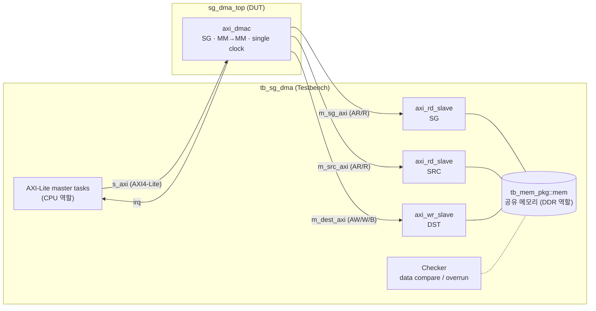
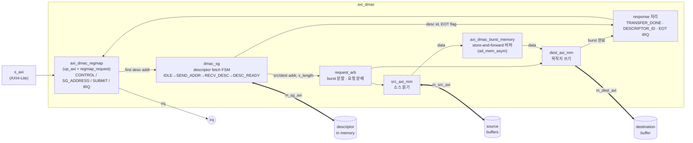
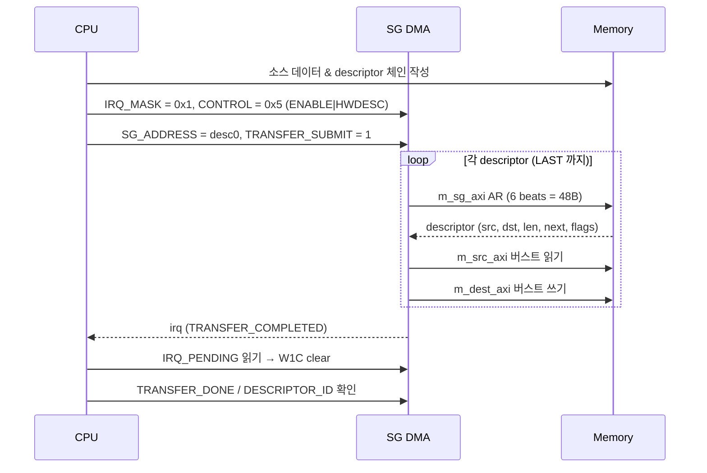

# pro-a-sgdma-hrcho : Scatter-Gather DMA

ADI(Analog Devices) 오픈소스 HDL의 `axi_dmac` IP를 기반으로, **SG(Scatter-Gather) DMA만 독립적으로 동작하도록 추출·구성**하고 Vivado xsim 환경에서 bring-up 검증까지 완료한 프로젝트입니다. 최종 목표는 이 SG DMA를 중심으로 SoC를 구성하고 SV/UVM 기반 검증 환경까지 확장하는 것입니다.

| 항목 | 상태 |
|---|---|
| RTL 추출 및 컴파일 | ✅ 완료 (Verilog-2001 모드, ERROR/WARNING 0) |
| SG DMA wrapper (`sg_dma_top`) | ✅ 완료 |
| Bring-up testbench | ✅ **TEST PASSED** (single descriptor / 3-descriptor gather) |
| 추가 directed test, SoC 통합, UVM | ⏳ 예정 |

---

## 목차

1. [SG DMA란?](#1-sg-dma란)
2. [Reference](#2-reference)
3. [SG DMA 스펙](#3-sg-dma-스펙)
4. [Block Diagram](#4-block-diagram)
5. [Reference에서 RTL을 가져온 방법](#5-reference에서-rtl을-가져온-방법)
6. [컴파일 및 Elaboration](#6-컴파일-및-elaboration)
7. [Testbench](#7-testbench)
8. [검증 결과](#8-검증-결과)
9. [처음부터 재현하기](#9-처음부터-재현하기)
10. [한계 및 향후 계획](#10-한계-및-향후-계획)

---

## 1. SG DMA란?

**DMA(Direct Memory Access)** 는 CPU가 데이터를 한 바이트씩 옮기는 대신, 전용 하드웨어가 메모리 간(또는 메모리↔주변장치 간) 데이터 전송을 대신 수행하게 하는 방식입니다. CPU는 "어디서, 어디로, 얼마나"만 알려주고 다른 일을 하다가, 전송이 끝나면 인터럽트로 통보받습니다.

일반적인 DMA(**Register / Simple mode**)는 한 번에 **연속된 메모리 블록 하나**만 전송할 수 있습니다. 데이터가 여러 곳에 흩어져 있으면 CPU가 블록마다 레지스터를 다시 설정하고 전송을 시작해야 하므로, 블록 수만큼 인터럽트와 소프트웨어 개입이 발생합니다.

**SG(Scatter-Gather) DMA** 는 이 문제를 **descriptor**로 해결합니다.

- 각 descriptor에는 "소스 주소, 목적지 주소, 길이, **다음 descriptor 주소**"가 들어 있습니다.
- CPU는 descriptor들을 메모리에 **linked list(체인)** 로 만들어 두고, **첫 descriptor의 주소만** DMA에 알려줍니다.
- DMA는 descriptor를 스스로 메모리에서 읽어오고, 체인을 따라가며 모든 블록을 전송한 뒤 **한 번만** 인터럽트를 발생시킵니다.

```
  Scatter : 연속된 소스  ─▶  흩어진 여러 목적지
  Gather  : 흩어진 여러 소스  ─▶  연속된 목적지

  [Desc0] ──next──▶ [Desc1] ──next──▶ [Desc2] (last)
     │                 │                 │
  src A → dst X     src B → dst Y     src C → dst Z
```

장점은 CPU 개입과 인터럽트 횟수가 줄어든다는 것, 그리고 OS가 할당한 비연속 물리 메모리(page 단위 버퍼 등)를 하나의 전송처럼 다룰 수 있다는 것입니다.

---

## 2. Reference

| 항목 | 내용 |
|---|---|
| Repository | https://github.com/analogdevicesinc/hdl |
| Branch | `hdl_2026_r1` (최신 릴리즈 브랜치) |
| Commit | `b62abeff22d613d08e1aeb7f94850ab6a6576a74` |
| 사용 IP | `library/axi_dmac` (ADI AXI DMA Controller) |
| IP 버전 | `VERSION` 레지스터 = `0x00040565` (4.05.65) |
| 공식 문서 | https://analogdevicesinc.github.io/hdl/library/axi_dmac/index.html |
| License | 파일별 GPL2 / ADI-BSD 이중 라이선스 (원본 헤더 및 `LICENSE*` 파일 유지) |

`axi_dmac`는 AXI-MM / AXI-Stream / FIFO 인터페이스, cyclic, 2D, framelock, autorun 등 많은 기능을 가진 범용 DMA이며, **`DMA_SG_TRANSFER` 파라미터를 켜면 SG 기능이 활성화**됩니다. 본 프로젝트는 이 중 SG 경로만 사용하도록 파라미터를 고정했습니다.

브랜치 선택 기준은 Vivado 버전이 아니라 **SG 기능 포함 여부**입니다. (`hdl_2022_r2` 등 구버전에는 SG가 없음, `hdl_2026_r1`에서 `grep DMA_SG_TRANSFER`로 확인)

---

## 3. SG DMA 스펙

### 3.1 구성 (Configuration)

`rtl/sg_dma/sg_dma_top.v`에서 `axi_dmac`의 파라미터를 아래와 같이 고정했습니다.

| 파라미터 | 값 | 설명 |
|---|---|---|
| `DMA_SG_TRANSFER` | 1 | Scatter-Gather 활성화 |
| `DMA_TYPE_SRC` / `DMA_TYPE_DEST` | 0 / 0 | 소스·목적지 모두 AXI-MM (memory → memory) |
| `DMA_DATA_WIDTH_SRC` / `_DEST` | 64 | 데이터 버스 폭 (wrapper 파라미터 `DATA_WIDTH`) |
| `DMA_DATA_WIDTH_SG` | 64 | descriptor fetch 버스 폭 (ADI는 64만 지원) |
| `DMA_AXI_ADDR_WIDTH` | 32 | 주소 폭 (wrapper 파라미터 `ADDR_WIDTH`) |
| `DMA_LENGTH_WIDTH` | 24 | 한 descriptor당 최대 전송 길이 2^24 B |
| `MAX_BYTES_PER_BURST` | 128 | AXI 버스트 최대 크기 (64bit × 16 beat) |
| `FIFO_SIZE` | 8 | 내부 store-and-forward 버퍼 = 8 burst × 128 B = 1 KB |
| `ASYNC_CLK_*` (6개) | 0 | 단일 클럭 도메인 (CDC 로직 bypass) |
| `DMA_AXI_PROTOCOL_*` | 0 | AXI4 (burst length 최대 256) |
| `CYCLIC` | 0 | ⚠️ axi_dmac 기본값이 1이므로 명시적으로 0 |
| `DMA_2D_TRANSFER`, `FRAMELOCK`, `AUTORUN`, `USE_EXT_SYNC`, `SYNC_TRANSFER_START` | 0 | 미사용 기능 비활성화 |

### 3.2 인터페이스

| 포트 그룹 | 프로토콜 | 방향 | 용도 |
|---|---|---|---|
| `clk`, `resetn` | - | in | 단일 클럭 / active-low 리셋 (모든 인터페이스 공통) |
| `s_axi_*` | AXI4-Lite slave, addr 11bit, data 32bit | in | 레지스터 맵 접근 (CPU) |
| `irq` | level | out | 인터럽트 |
| `m_sg_axi_*` | AXI4 master, **AR/R만**, data 64bit | out | descriptor fetch |
| `m_src_axi_*` | AXI4 master, **AR/R만** | out | 소스 데이터 읽기 |
| `m_dest_axi_*` | AXI4 master, **AW/W/B만** | out | 목적지 데이터 쓰기 |

AXI ID, lock, AXI-Stream / FIFO / framelock 포트는 wrapper 내부에서 tie-off 되어 외부에 노출되지 않습니다. (ID는 SoC 통합 시 interconnect가 부여)

### 3.3 Register Map

주소는 AXI4-Lite **byte address** 기준입니다. 본 구성(SG, MM→MM, 32bit 주소, 2D/framelock 비활성)에서 의미 있는 레지스터만 정리했습니다.

| Offset | 이름 | Type | 설명 |
|---|---|---|---|
| `0x000` | `VERSION` | RO | IP 버전. 본 구성 `0x00040565` |
| `0x004` | `PERIPHERAL_ID` | RO | `ID` 파라미터 값 |
| `0x008` | `SCRATCH` | RW | 디버그용 scratch 레지스터 |
| `0x00C` | `IDENTIFICATION` | RO | `0x444D4143` ("DMAC") |
| `0x010` | `INTERFACE_DESCRIPTION_1` | RO | 버스 폭, 인터페이스 타입, burst 폭 정보 |
| `0x080` | `IRQ_MASK` | RW | bit1: TRANSFER_COMPLETED, bit0: TRANSFER_QUEUED. **1 = mask(비활성)**, 리셋 기본값은 둘 다 mask |
| `0x084` | `IRQ_PENDING` | RW1C | mask되지 않은 발생 인터럽트. 1을 써서 clear |
| `0x088` | `IRQ_SOURCE` | RO | mask와 무관하게 발생한 인터럽트 |
| `0x400` | `CONTROL` | RW | bit0 `ENABLE`, bit1 `PAUSE`, **bit2 `HWDESC`(SG 모드)** |
| `0x404` | `TRANSFER_ID` | RO | 다음에 submit될 transfer ID (0~3) |
| `0x408` | `TRANSFER_SUBMIT` | RW | 1을 쓰면 transfer 큐잉. 큐잉되면 0으로 복귀 |
| `0x40C` | `FLAGS` | RW | bit0 CYCLIC, bit1 TLAST, bit2 PARTIAL_REPORTING_EN |
| `0x410` | `DEST_ADDRESS` | RW | (non-SG 모드용) 목적지 주소 |
| `0x414` | `SRC_ADDRESS` | RW | (non-SG 모드용) 소스 주소 |
| `0x418` | `X_LENGTH` | RW | (non-SG 모드용) 전송 바이트 수 − 1 |
| `0x428` | `TRANSFER_DONE` | RO | bit[3:0]: transfer ID별 완료 여부 |
| `0x42C` | `ACTIVE_TRANSFER_ID` | RO | 현재 진행 중인 transfer ID |
| `0x434` | `CURRENT_DEST_ADDRESS` | RO | 다음에 쓸 목적지 주소 |
| `0x438` | `CURRENT_SRC_ADDRESS` | RO | 다음에 읽을 소스 주소 |
| `0x448` | `TRANSFER_PROGRESS` | RO | 현재 transfer에서 목적지로 전송된 바이트 수 (debug) |
| `0x454` | `DESCRIPTOR_ID` | RO | **현재/마지막으로 처리한 descriptor의 id** (SG 모드) |
| `0x47C` | `SG_ADDRESS` | RW | **첫 descriptor의 주소** (SG 모드) |

> 전체 레지스터 목록(2D stride, framelock, 64bit 주소 HIGH 레지스터 등)은 ADI 공식 문서를 참고하세요. 본 구성에서는 해당 기능이 비활성화되어 있습니다.

### 3.4 Descriptor 포맷

`dmac_sg.v`의 파싱 로직에서 확인한 포맷입니다. SG 포트는 descriptor 하나를 **64bit × 6 beat (48 bytes), INCR burst (`arlen=5`, `arsize=3`)** 로 한 번에 읽습니다.

| Offset | [63:32] | [31:0] |
|---|---|---|
| `+0x00` | `id` (32bit, `DESCRIPTOR_ID`로 보고됨) | `flags` [1:0] |
| `+0x08` | `dest_addr` (64bit) | |
| `+0x10` | `src_addr` (64bit) | |
| `+0x18` | `next_desc_addr` (64bit) | |
| `+0x20` | `x_length` (**바이트 수 − 1**) | `y_length` (행 수 − 1, 2D 전용 → 0) |
| `+0x28` | `dest_stride` (2D 전용 → 0) | `src_stride` (2D 전용 → 0) |

| flags bit | 이름 | 의미 |
|---|---|---|
| bit0 | `LAST` | 1이면 이 descriptor 처리 후 체인 종료. 0이면 `next_desc_addr`로 이동 |
| bit1 | `EOT_IRQ` | 1이면 이 descriptor 전송 완료 시 TRANSFER_COMPLETED 인터럽트 발생 |

`x_length = 바이트 수 − 1` 규칙은 bring-up TB에서 정확한 바이트 수 전송과 overrun 없음으로 검증되었습니다.

### 3.5 프로그래밍 시퀀스

```text
1. 메모리에 소스 데이터와 descriptor 체인 작성 (마지막 descriptor만 flags = 0b11)
2. IRQ_MASK      (0x080) = 0x1   // TRANSFER_COMPLETED 인터럽트 unmask
3. CONTROL       (0x400) = 0x5   // ENABLE | HWDESC
4. SG_ADDRESS    (0x47C) = 첫 descriptor 주소
5. TRANSFER_SUBMIT (0x408) = 0x1
6. irq 대기
7. IRQ_PENDING   (0x084) 읽기 → 읽은 값 그대로 써서 clear (W1C)
8. TRANSFER_DONE (0x428), DESCRIPTOR_ID (0x454)로 완료 확인
```

### 3.6 제약 사항

- **Descriptor 주소**: 하위 3bit가 무시되므로 8-byte 정렬 필수. 48B burst가 4KB 경계를 넘지 않도록 배치 (본 TB는 64B 간격 배치).
- **전송 길이 정렬**: MM→MM 구성에서는 `DMA_LENGTH_ALIGN = 0`으로 계산되어 **바이트 단위 길이 제약이 없음** (RTL 주석: "MM has no alignment requirements").
- **Burst**: 전송은 `MAX_BYTES_PER_BURST`(128B) 단위로 분할됨. ADI 문서는 4KB 경계 문제를 피하기 위해 시작 주소를 `MAX_BYTES_PER_BURST`에 정렬할 것을 권장.
- **SG 버스 폭**: 64bit 고정.

---

## 4. Block Diagram

### 4.1 검증 환경 전체 구조 (Testbench + DUT)



### 4.2 SG DMA 내부 데이터 흐름 (개념도)

주요 RTL 모듈의 역할을 데이터 흐름 기준으로 표현한 개념도입니다. 정확한 인스턴스 계층은 `axi_dmac.v`를 참고하세요.



### 4.3 SG 전송 시퀀스



> 실제 동작에서는 descriptor fetch와 데이터 전송이 **파이프라인으로 겹칩니다.** (첫 데이터 전송이 끝나기 전에 다음 descriptor들을 미리 가져옴, [8장](#8-검증-결과) 참고)

---

## 5. Reference에서 RTL을 가져온 방법

### 5.1 디렉토리 구조

```text
pro-a-sgdma-hrcho/
├── README.md
├── .gitignore
├── filelists/
│   ├── rtl.f                     # RTL filelist (sim/ 기준 상대경로)
│   └── tb.f                      # TB filelist
├── patches/
│   └── 0001-burst-memory-zero-replication.patch
├── rtl/
│   ├── sg_dma/
│   │   └── sg_dma_top.v          # ★ SG DMA wrapper (본 프로젝트의 IP 경계)
│   └── third_party/adi_hdl/      # ADI 원본 (직접 수정 금지, 패치로만 변경)
│       ├── README.md             # upstream branch / commit / 적용 패치 기록
│       ├── LICENSE*
│       └── library/{axi_dmac, common, util_axis_fifo, util_cdc}/
├── scripts/
│   └── import_adi_dmac.sh        # 원본 복사 + 패치 적용 + 출처 기록 자동화
├── sim/
│   └── Makefile                  # make sim / make gui / make clean
└── tb/
    ├── common/
    │   ├── tb_mem_pkg.sv         # 공유 메모리
    │   └── axi_mem_slave.sv      # AXI read/write slave 모델
    └── sg_dma/
        └── tb_sg_dma.sv          # bring-up testbench top
```

ADI repo 전체는 이 repo **밖**(`~/Workspace/adi_hdl`)에 clone하여 참고용으로만 사용하고, 필요한 파일만 복사해 관리합니다.

### 5.2 추출한 파일

필요한 파일 목록은 추측하지 않고, ADI가 정의해 둔 `library/axi_dmac/Makefile`의 `GENERIC_DEPS`와 `axi_dmac_ip.tcl`의 `adi_ip_files` 목록, 그리고 의존 라이브러리(`XILINX_LIB_DEPS`: `util_axis_fifo`, `util_cdc`)를 기준으로 결정했습니다.

| 경로 | 파일 | 비고 |
|---|---|---|
| `library/axi_dmac/` | `.v` 27개 + `inc_id.vh`, `resp.vh` | DMA 본체 (SG 핵심: `dmac_sg.v`) |
| `library/common/` | `ad_mem_asym.v`, `ad_mem.v`, `up_axi.v` | burst memory RAM, AXI-Lite 레지스터 인터페이스 |
| `library/util_axis_fifo/` | `util_axis_fifo.v`, `util_axis_fifo_address_generator.v` | 내부 FIFO (descriptor/ID 큐 등) |
| `library/util_cdc/` | `sync_bits.v`, `sync_data.v`, `sync_event.v`, `sync_gray.v` | CDC (단일 클럭 구성에서는 bypass) |

**제외한 파일**: `*.ttcl`, `*_ip.tcl`, `*_hw.tcl`, `*_ltt.tcl`, `*.sdc`, `bd/`, `interfaces/`, `tb/` — 모두 Vivado/Quartus/Lattice IP 패키징 또는 벤더 전용 파일이며 RTL 시뮬레이션에는 불필요합니다.

### 5.3 Import 자동화

`scripts/import_adi_dmac.sh` 한 번으로 다음을 수행합니다.

1. ADI 원본 RTL 복사 (`~/Workspace/adi_hdl` → `rtl/third_party/adi_hdl`)
2. `patches/*.patch` 자동 적용 (`git apply`)
3. `rtl/third_party/adi_hdl/README.md`에 upstream branch, commit, 적용된 패치 목록 기록

ADI 버전을 올리거나 파일이 꼬였을 때도 스크립트만 다시 실행하면 "원본 + 로컬 수정" 상태가 재현됩니다.

### 5.4 수정 사항 (Local Patch)

| 패치 | 파일 | 내용 |
|---|---|---|
| `0001-burst-memory-zero-replication.patch` | `axi_dmac_burst_memory.v` 163행 | 0 replication 제거 |

**원인**: `axi_dmac.v`에서 `DMA_LENGTH_ALIGN`은 아래처럼 계산됩니다.

```verilog
/* MM has no alignment requirements */
localparam DMA_LENGTH_ALIGN_SRC  = DMA_TYPE_SRC  == DMA_TYPE_AXI_MM ? 0 : BYTES_PER_BEAT_WIDTH_SRC;
localparam DMA_LENGTH_ALIGN_DEST = DMA_TYPE_DEST == DMA_TYPE_AXI_MM ? 0 : BYTES_PER_BEAT_WIDTH_DEST;
localparam DMA_LENGTH_ALIGN = max(DMA_LENGTH_ALIGN_SRC, DMA_LENGTH_ALIGN_DEST);
```

MM→MM 구성에서는 `DMA_LENGTH_ALIGN = 0`이 되어 `burst_memory`의 `{DMA_LENGTH_ALIGN{1'b1}}`가 `{0{1'b1}}`(0 replication)이 됩니다. 단독 0 replication은 Verilog-2001은 물론 SystemVerilog LRM에서도 불법이며, xsim은 이를 elaboration ERROR로 처리합니다. (`-sv` 모드로도 해결되지 않음을 확인)

**수정**: 의미가 동일하고 문법적으로 안전한 식으로 변경했습니다.

```verilog
// before : DMA_LENGTH_ALIGN = 0 이면 불법
reg [BYTES_PER_BURST_WIDTH+1-1:0] dest_burst_len_data = {DMA_LENGTH_ALIGN{1'b1}};
// after  : N=0 → 0, N=3 → 3'b111 (하위 N비트 1) 로 원래 의도와 동일
reg [BYTES_PER_BURST_WIDTH+1-1:0] dest_burst_len_data = (1 << DMA_LENGTH_ALIGN) - 1;
```

Git 이력상 `Import ADI axi_dmac RTL (hdl_2026_r1) - pristine` 커밋이 원본 기준점이며, 이후 커밋과의 diff가 곧 로컬 수정 사항입니다.

---

## 6. 컴파일 및 Elaboration

| 항목 | 내용 |
|---|---|
| OS | Linux (bash) |
| Simulator | Vivado 2024.2 xsim (`xvlog` / `xelab` / `xsim`) |
| RTL 컴파일 모드 | **Verilog-2001** (`-sv` 없음) → 이식성 확보 (VCS 등 다른 툴로 이전 용이) |
| TB 컴파일 모드 | SystemVerilog (`-sv`) |

ADI의 `make`/IP 패키징 흐름은 사용하지 않으므로 ADI 스크립트의 Vivado 버전 체크(`scripts/adi_env.tcl`)와 무관합니다.

```bash
source /edatools/Xilinx/Vivado/2024.2/settings64.sh
cd sim
xvlog     -f ../filelists/rtl.f -log xvlog_rtl.log     # RTL (include path: -i .../axi_dmac)
xvlog -sv -f ../filelists/tb.f  -log xvlog_tb.log      # TB
xelab tb_sg_dma -debug typical -s tb_sg_dma_snap
xsim  tb_sg_dma_snap -R
```

위 과정은 `sim/Makefile`로 묶여 있어 `make sim` 한 줄로 실행됩니다.

**진행 이력**

| 단계 | 결과 |
|---|---|
| 1. `axi_dmac` 단독 컴파일 | ✅ ERROR 0 |
| 2. `axi_dmac` + SG 파라미터 elaboration | ❌ `burst_memory.v:163` 0 replication → 패치 0001로 해결 |
| 3. `sg_dma_top` wrapper elaboration | ✅ ERROR 0, wrapper 관련 WARNING 0 |
| 4. TB 포함 시뮬레이션 | ✅ TEST PASSED |

남아 있는 WARNING은 ADI 내부의 `util_axis_fifo` 인스턴스에서 `m_axis_tkeep` 출력을 연결하지 않은 것(`VRFC 10-3645`)뿐이며 동작에 영향이 없습니다.

---

## 7. Testbench

### 7.1 목적

본 TB는 **bring-up(동작 확인)용 directed testbench** 입니다. `axi_dmac` 자체는 ADI가 검증한 IP이므로, 여기서는 IP 내부 버그 탐색보다 **통합(integration)의 정합성**을 확인합니다.

- 파라미터 구성(SG + MM→MM + 단일 클럭)과 로컬 패치가 동작을 깨뜨리지 않았는가
- wrapper의 포트 연결과 tie-off가 올바른가
- descriptor 포맷과 레지스터 프로그래밍 순서를 올바르게 이해했는가

TB 컴포넌트는 향후 UVM 전환을 염두에 두고 분리했습니다. (메모리 모델 → slave agent, AXI-Lite task → register agent driver, checker → scoreboard)

### 7.2 구성 요소

| 파일 | 구성 요소 | 설명 |
|---|---|---|
| `tb/common/tb_mem_pkg.sv` | 공유 메모리 | sparse byte-addressable associative array. SG/SRC/DST 세 포트와 TB가 같은 메모리를 공유 (실제 SoC에서 DDR 하나를 공유하는 상황과 동일) |
| `tb/common/axi_mem_slave.sv` | `axi_rd_slave` | AR/R 채널 slave. SRC와 SG 포트에 사용. AR 수신 시 로그 출력 |
| | `axi_wr_slave` | AW/W/B 채널 slave. DST 포트에 사용. `wstrb` 반영, `WLAST` 위치 검사 |
| `tb/sg_dma/tb_sg_dma.sv` | `axil_write` / `axil_read` | AXI4-Lite master task (CPU 역할) |
| | `write_desc` | 3.4절 포맷대로 메모리에 descriptor 작성 |
| | `check_copy` / `check_untouched` | 바이트 단위 데이터 비교 / 목적지 뒤쪽 overrun 검사 |
| | `wait_done` | irq 대기(timeout 포함), `IRQ_PENDING` 확인 및 W1C clear |
| `sim/Makefile` | 실행 스크립트 | `make sim`, `make gui`, `make clean` |

### 7.3 테스트 시나리오

| 테스트 | 내용 | 메모리 배치 |
|---|---|---|
| 공통 | `IDENTIFICATION == "DMAC"` 확인 후 `IRQ_MASK=0x1`, `CONTROL=0x5` | - |
| **TEST 1** | descriptor 1개, 256B 단순 복사 | desc `0x1000`, src `0x10000` → dst `0x20000` |
| **TEST 2** | descriptor 3개 체인, **gather** (흩어진 소스 → 연속 목적지) | desc `0x1100 → 0x1140 → 0x1180`<br>src `0x11000`(128B), `0x13000`(256B), `0x15000`(64B)<br>→ dst `0x21000`부터 연속 448B |

각 테스트의 PASS 조건은 irq 발생, `IRQ_PENDING[1]`(TRANSFER_COMPLETED) set, 전 바이트 일치, 목적지 끝 이후 16B 미기록(overrun 없음)입니다.

### 7.4 실행

```bash
cd sim
make clean
make sim      # batch 실행
make gui      # 파형 확인 (X11 forwarding 필요)
```

---

## 8. 검증 결과

**✅ TEST PASSED** (시뮬레이션 종료 시각 2,895 ns, 100 MHz)

```text
VERSION        = 0x00040565
IDENTIFICATION = 0x444d4143

===== TEST 1 : single descriptor (256 bytes) =====
[555000]   SG AR  addr=0x00001000 beats=6 size=8B
[675000]  SRC AR  addr=0x00010000 beats=16 size=8B
[855000]  DST AW  addr=0x00020000 beats=16 size=8B
[855000]  SRC AR  addr=0x00010080 beats=16 size=8B
[1065000]  DST AW  addr=0x00020080 beats=16 size=8B
[1275000] TEST1 : irq asserted
  IRQ_PENDING   = 0x00000002
  TRANSFER_DONE = 0x00000001
  DESCRIPTOR_ID = 0x000000a0
[PASS] TEST1 : 256 bytes 0x00010000 -> 0x00020000
[PASS] TEST1 tail : no overrun after 0x00020100

===== TEST 2 : 3-descriptor chain, gather =====
[1635000]   SG AR  addr=0x00001100 beats=6 size=8B
[1715000]   SG AR  addr=0x00001140 beats=6 size=8B
[1755000]  SRC AR  addr=0x00011000 beats=16 size=8B
[1795000]   SG AR  addr=0x00001180 beats=6 size=8B
[1935000]  DST AW  addr=0x00021000 beats=16 size=8B
[1935000]  SRC AR  addr=0x00013000 beats=16 size=8B
[2115000]  SRC AR  addr=0x00013080 beats=16 size=8B
[2145000]  DST AW  addr=0x00021080 beats=16 size=8B
[2295000]  SRC AR  addr=0x00015000 beats=8 size=8B
[2335000]  DST AW  addr=0x00021100 beats=16 size=8B
[2525000]  DST AW  addr=0x00021180 beats=8 size=8B
[2655000] TEST2 : irq asserted
  IRQ_PENDING   = 0x00000002
  TRANSFER_DONE = 0x00000003
  DESCRIPTOR_ID = 0x000000b2
[PASS] TEST2 seg0 : 128 bytes 0x00011000 -> 0x00021000
[PASS] TEST2 seg1 : 256 bytes 0x00013000 -> 0x00021080
[PASS] TEST2 seg2 : 64 bytes 0x00015000 -> 0x00021180
[PASS] TEST2 tail : no overrun after 0x000211c0

  TEST PASSED
```

### 8.1 결과 해석

| 관찰 | 의미 |
|---|---|
| `VERSION`, `IDENTIFICATION`이 문서와 일치 | AXI-Lite 경로 및 레지스터 오프셋 정상 |
| `SG AR beats=6 size=8B` | descriptor 1개 = 64bit × 6 beat = 48B, RTL 분석과 일치 |
| 256B가 `16 beat × 2`로 분할 | `MAX_BYTES_PER_BURST`(128B) 단위 burst 분할 |
| 정확한 바이트 수 + overrun 없음 | **`x_length = 바이트 수 − 1` 포맷 검증** |
| TEST 2에서 `SG AR`이 0x1100 → 0x1140 → 0x1180 | `next_desc_addr` 체인을 올바르게 따라감 |
| 세 descriptor를 첫 데이터 전송 완료 전에 모두 fetch | **descriptor prefetch** — fetch와 데이터 전송이 파이프라인으로 겹침 |
| 소스 세그먼트(128/256/64B)와 무관하게 DST가 `0x21000/0x21080/0x21100/0x21180`에 연속 기록 | **gather 동작 확인** — 목적지 주소 기준으로 burst 재분할 |
| `SRC AR` 후 약 18 cycle 뒤 `DST AW` | **store-and-forward** — burst 하나를 burst memory에 다 채운 뒤 쓰기 시작 |
| `IRQ_PENDING = 0x2` | 마지막 descriptor의 `EOT_IRQ` flag로 TRANSFER_COMPLETED 발생 |
| `TRANSFER_DONE = 0x1 → 0x3` | transfer ID 0(TEST1), 1(TEST2) 순서대로 완료 |
| `DESCRIPTOR_ID = 0xa0 / 0xb2` | 마지막으로 처리한 descriptor의 id 보고 |

### 8.2 성능 수치에 대한 주의

TEST 1은 256B(32 beat) 전송에 약 72 cycle이 소요되었으나, 이는 DMA 성능이 아니라 **TB 메모리 모델의 한계**(single outstanding, 트랜잭션 사이 ready 버블) 때문입니다. 대역폭 측정을 위해서는 multiple outstanding과 latency 설정이 가능한 메모리 모델이 필요합니다.

---

## 9. 처음부터 재현하기

```bash
# 0) 환경
source /edatools/Xilinx/Vivado/2024.2/settings64.sh

# 1) Reference clone (이 repo 밖)
cd ~/Workspace
git clone https://github.com/analogdevicesinc/hdl.git adi_hdl
cd adi_hdl && git checkout hdl_2026_r1

# 2) 이 repo clone
cd ~/Workspace
git clone <this-repo-url> pro-a-sgdma-hrcho
cd pro-a-sgdma-hrcho

# 3) (선택) ADI RTL 재import + 패치 적용 — repo에 이미 포함되어 있으므로 업데이트 시에만
./scripts/import_adi_dmac.sh

# 4) 시뮬레이션
cd sim && make sim
```

`filelists/rtl.f`는 아래 명령으로 재생성할 수 있습니다. (`sim/` 디렉토리 기준 상대경로)

```bash
cd sim
{ echo "-i ../rtl/third_party/adi_hdl/library/axi_dmac"
  find ../rtl -name "*.v" | sort; } > ../filelists/rtl.f
```

---

## 10. 한계 및 향후 계획

### 현재 한계

- **TB 메모리 모델**: single outstanding, INCR burst만 지원, 항상 OKAY 응답, 랜덤 지연 없음
- **검증 범위**: directed test 2개 (bring-up 수준). 코너 케이스, 에러 응답, backpressure 미검증
- **구성**: 32bit 주소, 단일 클럭, MM→MM만 사용

### 향후 계획

1. **Bring-up 테스트 보강**
   - 버스 폭에 정렬되지 않은 길이 (1~7B, 홀수 길이) — `DMA_LENGTH_ALIGN=0` 패치의 동작 검증
   - 4KB 경계 근처 주소
   - 메모리 모델에 랜덤 ready 지연 추가 (backpressure)
   - descriptor별 `EOT_IRQ`, 긴 체인
2. **SoC 구성**: AXI interconnect + 메모리 + CPU BFM, 추가 IP 통합
3. **SV/UVM 검증 환경**: AXI agent, register model, scoreboard, constrained random, functional coverage, assertion
4. **성능 검증**: multiple outstanding 메모리 모델 기반 bandwidth 측정

---

## License

`rtl/third_party/adi_hdl/` 이하 파일은 Analog Devices, Inc.의 저작물이며 각 파일 헤더에 명시된 라이선스(GPL2 또는 ADI-BSD)를 따릅니다. 원본 라이선스 파일은 `rtl/third_party/adi_hdl/LICENSE*`에 포함되어 있습니다.